# Data-Mining
# 
 🧮 Data Mining EDA Project 🧮 

## 
 This repository contains an exciting project conducted as part of a "Data Mining" course. The project encompasses the building of a data classification and clustering system, followed by EDA - Exploratory Data Analysis, and is concluded with the presentation of the results. This ReadMe file provides an outline of the project structure, modules, and methods used, along with the technical requirements needed to successfully run the project.

 

## ⚙️ Technologies and Packages 📦 

To run the project, make sure the following Python libraries are installed:
easygui
pandas
scipy
sklearn
The project is written in Python and utilizes several key Python libraries for data analysis and machine learning, such as pandas, sklearn, scipy, and easygui for creating a simple GUI. The details about the project structure are listed below:

 

## 📁 Project Structure 📚
The project is structured into several Python files, each responsible for specific aspects of the data processing, modeling, and user interaction. Here's a quick rundown:

 -  FinalProject.py: This script manages the user interface, file inputs, model selection, data normalization and discretization, and automated data cleaning tasks.

 -  Classification.py: This script is responsible for activating the user-selected machine learning model. It includes our implementation and sklearn's implementation of Naive Bayes and Decision Tree classifiers, along with KNN and KMeans models from sklearn.

 -  Completion.py: Responsible for handling missing data based on the user's preference in the GUI interface.

 -  Discretization.py: This script performs discretization based on the user's choice in the GUI interface. The options include pandas equal frequency, equal width, and entropy-based discretization, along with our implementations of equal frequency and width discretization.

 -  Normalization.py: Handles normalization based on the user's selection in the GUI interface. The options include Z-Score, Min-Max, and Decimal Scaling.
  

## 📈 Exploratory Data Analysis and Experimentation 🔬
Our analysis includes a comprehensive EDA of the data, followed by running various classification and clustering models. This process includes testing accuracy, precision, recall, F-measure, and creating a confusion matrix. All the experimentation, results, visualizations, and discussions are compiled in a PDF file using Jupyter Notebook.
 
For each experiment, initial preprocessing steps are carried out, most of which are based on input from the user, including handling missing data, data normalization, discretization, and model selection. The processed data and built models are saved as CSV and pickle/joblib files respectively.

 

## 📊 Results 📝
The performance of our models is measured based on several evaluation metrics such as accuracy, precision, recall, and F-measure. We also construct confusion matrices for a clearer understanding of the models' performance. The results of the experiments, including hypothesis tests, visualizations, and discussions, are available in the Jupyter Notebook PDF.
 

## 💡 Conclusion and Future Work 🔮
After rigorous experimentation and analysis, the project culminates in discussing the results and drawing meaningful conclusions. The project adheres to the best coding practices, including extensive code documentation and logical organization of functions, classes, and modules.

 

## 🎯 Tasks 📋
In this project, we perform various tasks such as:

 -- Building a user-friendly GUI.
 -- Pre-processing steps including handling missing data, data normalization and discretization.
 -- Building classification models - Naive Bayes, Decision Tree and KNN.
 -- Building clustering models - KMeans.
 -- Running the models on training and test datasets.
 -- Evaluating model performance and reporting.
The dataset used in the project contains both continuous and categorical features, and records with missing values.

 

## 
 Your contribution and feedback are highly appreciated. Please feel free to fork, star or raise issues. Happy Coding! 💻🉠

